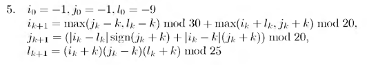

# Вариант № 5

**Условие требует уточнения:** рисунок содержит рекуррентные формулы, а шаблон — проверку точки в области. Не заданы область и критерий остановки.

Проверка завершится ошибкой до уточнения: [tests.json](tests.json).
